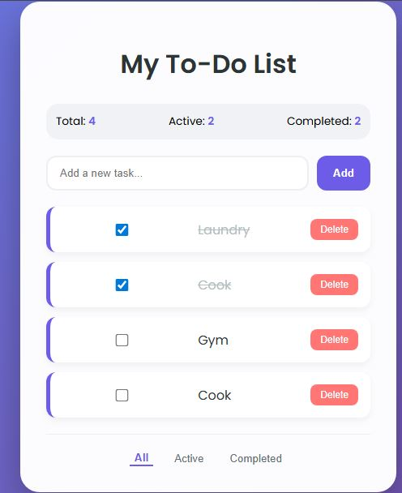

# Week 7: Premium To-Do List with Persistence

## Author
- **Name:** Stephen Mwai
- **GitHub:** [@stephen-mwai-dev](https://github.com/stephen-mwai-dev)
- **Date:** April 20, 2026

## Project Description
A fully functional to-do list web app that saves tasks and filter preferences using localStorage. Built with vanilla JavaScript modules to demonstrate clean code, state management, and data persistence.

## Technologies Used
- HTML5
- CSS3 (Flexbox, CSS variables, gradients)
- JavaScript (ES6 modules, localStorage API)
- Git & GitHub

## Features
- ✅ Add, delete, and mark tasks as complete
- ✅ Tasks persist after page refresh (localStorage)
- ✅ Filter tasks: All / Active / Completed
- ✅ Filter preference is also saved (refresh keeps your last selected tab)
- ✅ Clean module separation: `storage.js` handles persistence, `app.js` manages UI
- ✅ Responsive design

## How to Run
1. Clone this repository
2. Open the folder in VS Code
3. Install Live Server extension
4. Right-click `index.html` → Open with Live Server

> **Note:** ES6 modules require a local web server. Opening `index.html` directly as a file will cause CORS errors.

## Lessons Learned
- How to use `localStorage` to persist data across browser sessions.
- Import/export ES6 modules to organize code.
- Git basics: init, add, commit, remote, push, and handling merge conflicts.
- The difference between `e.target` and `e.currentTarget` in event listeners.

## Challenges Faced
- **Filter not persisting after refresh** – solved by saving the filter value to `localStorage` and loading it on init.
- **Git push rejected** because GitHub auto‑created a README – learned to use `git push -f` when the remote history is irrelevant.
- **ES modules CORS error** – discovered that `file://` protocol doesn’t work; switched to Live Server.

## Screenshots

## Live Demo (if deployed)

